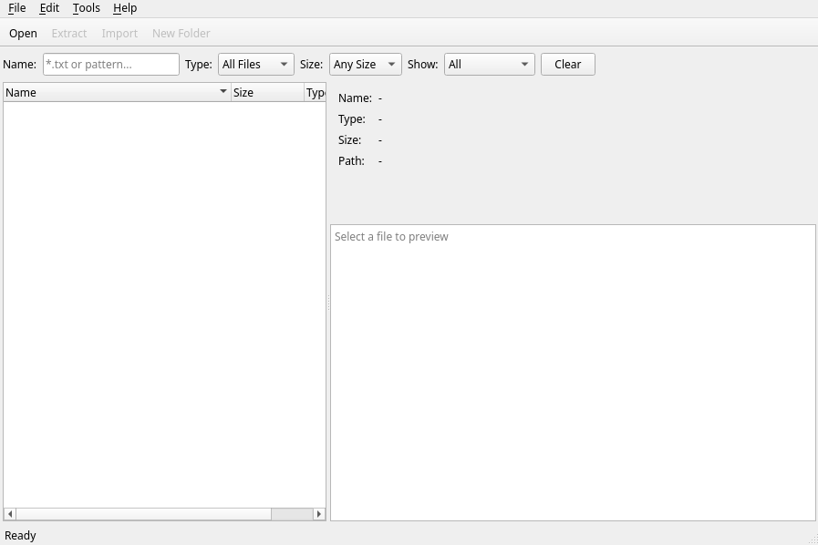

# PK2UI

A PyQt6-based GUI editor for Silkroad Online PK2 archive files.



## Features

- Browse PK2 archive contents with tree view
- Extract files and folders
- Import files into archives
- Create new folders
- Preview text files and images (including DDJ/DDS formats)
- Filter files by name (glob patterns), type, and size
- Compare two archives and copy differences

## Installation

```bash
# Install dependencies
uv sync

# Run the application
uv run main.py
```

## Building Standalone Executable

```bash
# Linux
uv run pyinstaller --onefile --noconsole --name pk2ui \
  --add-data "pyproject.toml:." \
  --hidden-import pk2api --hidden-import PyQt6 \
  --hidden-import PyQt6.QtCore --hidden-import PyQt6.QtWidgets \
  --hidden-import PyQt6.QtGui main.py

# Windows (use semicolon instead of colon)
pyinstaller --onefile --noconsole --name pk2ui \
  --add-data "pyproject.toml;." \
  --hidden-import pk2api --hidden-import PyQt6 \
  --hidden-import PyQt6.QtCore --hidden-import PyQt6.QtWidgets \
  --hidden-import PyQt6.QtGui main.py
```

## Dependencies

- PyQt6 >= 6.5
- pk2api
